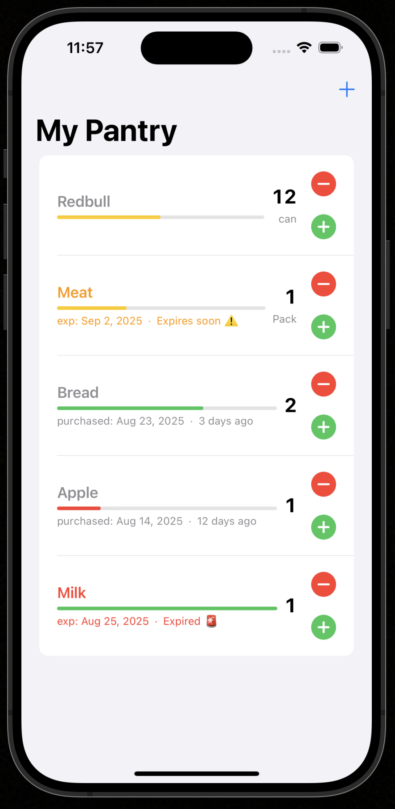
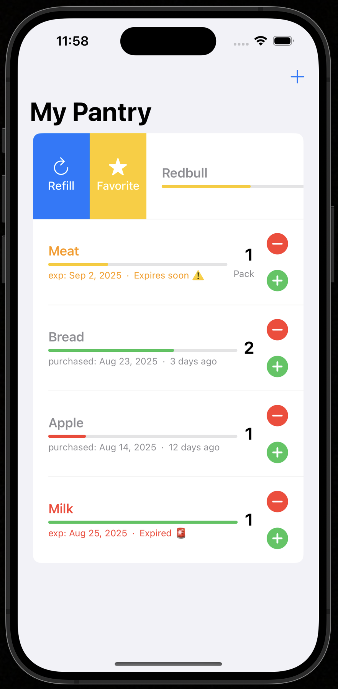
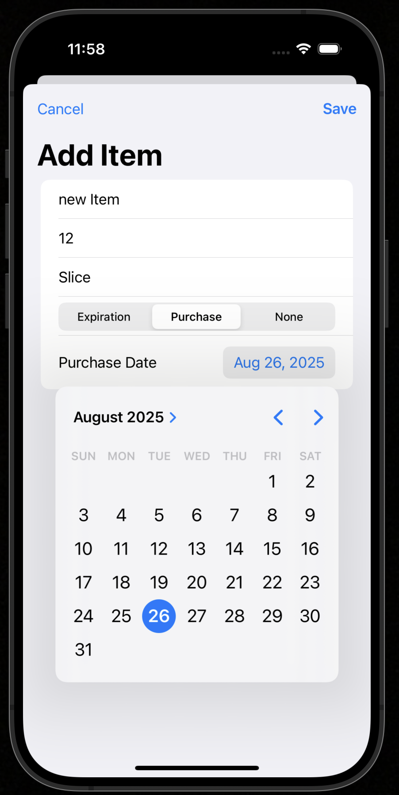
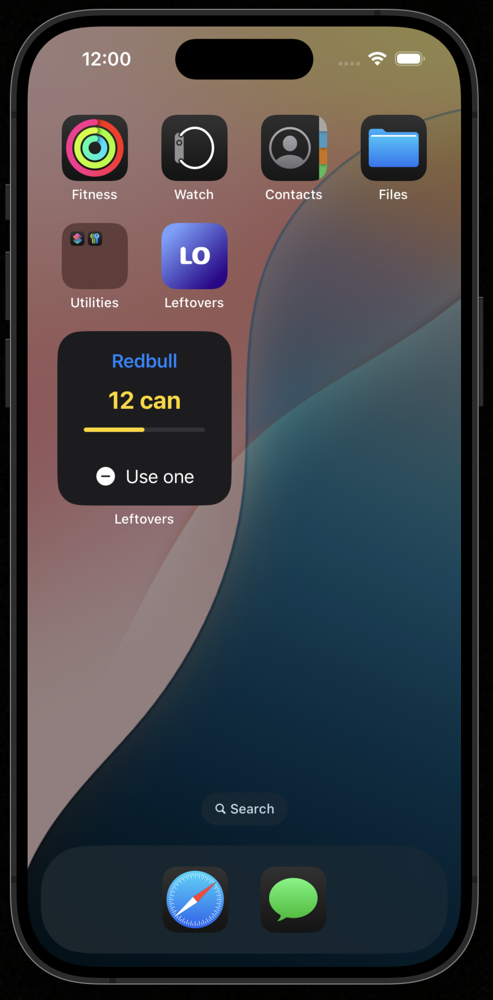
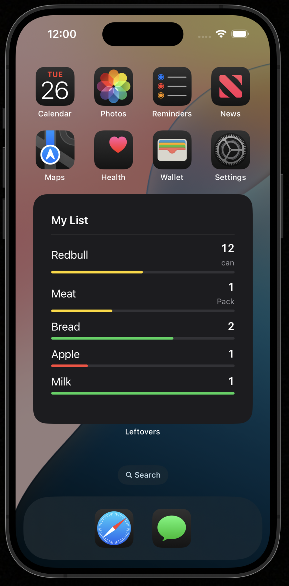

# Leftovers
Stop losing track of food and supplies. Leftovers keeps a clear inventory with smart status colors, helpful reminders, and home screen widgets so you use what you already have.

##### Leftovers app screenshot

  
   
  
  
  

## Why this helps
- Reduces waste by warning you before items expire
- Saves time with a simple, top aligned list that is easy to scan
- Keeps the most important item one tap away with a favorite widget

## Key features
- Item list with name, count, unit, and a color coded progress bar
- One date mode per item: expiration, purchase, or none
- Clear labels such as `exp: 2025 Aug 30 • Expires today` or `purchased: 2025 Aug 20 • 3 days ago`
- Refill sheet to add quantity and switch the tracked date mode
- Favorite one item for the small widget
- Widgets in small and large sizes with matching colors
- Local notifications
  - Expiration alerts seven days before and on the expiration day
  - Low stock alert the first time an item drops below thirty percent
- All data stored locally in an Application Group container

## Quick start
1. Open the project in Apple Xcode
2. Add an Application Group to the application target and the widget extension target
3. Set your group identifier in `SharedKeys.suite`
4. Build and run the application target on a simulator or a device

## Widgets
- Small widget shows your favorite item with a decrement action
- Large widget shows My List with a divider and as many rows as will fit
- Both sizes use the same shared color theme

## Notifications (under developement 🚧)
- The application requests permission on first launch
- Each item in expiration mode gets two alerts
  - Seven days before the expiration date at 09:00 local time
  - On the expiration date at 09:00 local time
- Low stock alert fires when remaining quantity first falls below thirty percent
- Widgets cannot schedule notifications. The application handles all alerts

## Data and privacy
- No sign in and no network connection
- Data lives only on your device inside the Application Group container

## Tech
- Apple Swift and the SwiftUI framework for the user interface
- WidgetKit for home screen widgets
- UserNotifications for local alerts

## Roadmap
- Edit screen for items
- Optional reminder time per item
- Cloud backup of the Application Group container
- Quick actions in the large widget

## License
Massachusetts Institute of Technology License. See the `LICENSE` file.

